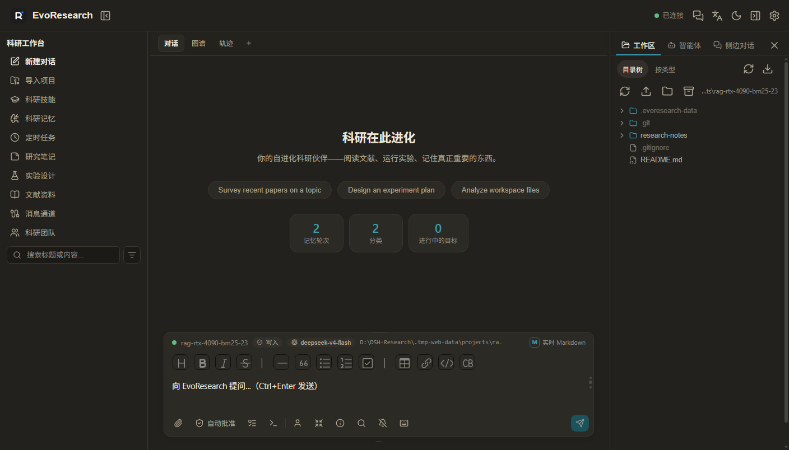
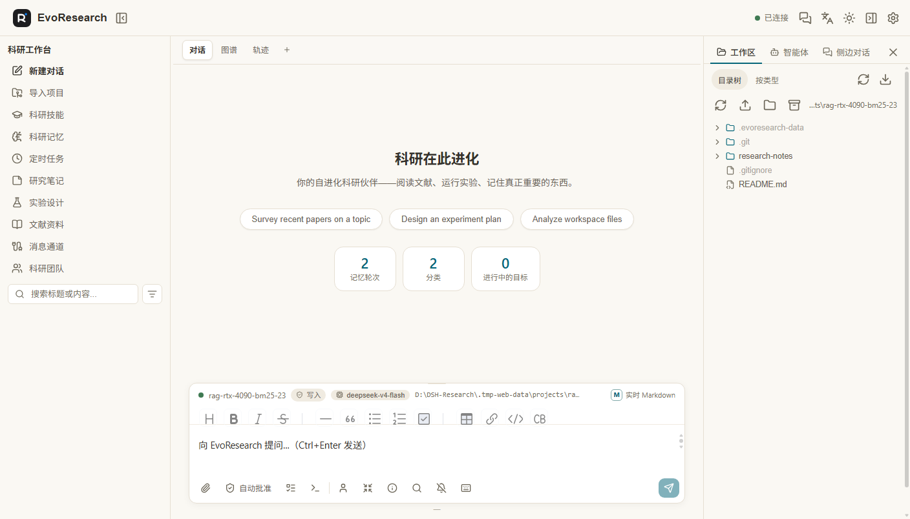
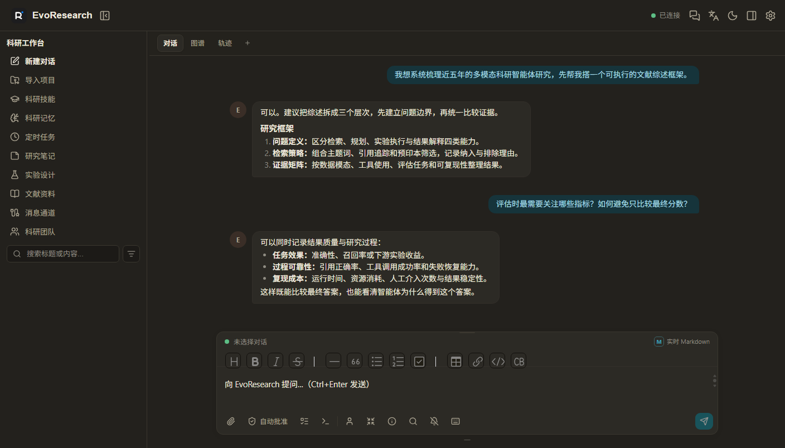

<div align="center">

# EvoResearch

**让科研工作从想法到论文，在一个地方持续推进。**

面向研究者的本地科研智能体工作台：对话、文献、项目文件、实验记录与长期记忆彼此连接，
让每一次提问都能沿着清晰的研究脉络继续下去。

[](https://github.com/Karbo123/DSH-EvoResearch/releases)
[]()
[](LICENSE)

</div>

<p align="center">
  
  
  
</p>

## 你可以用 EvoResearch 做什么

- **科研对话**：围绕研究问题持续追问、拆解任务，并保留完整上下文。
- **Chat Graph**：从任意消息分支、回到关键节点，组织不同假设与研究路线。
- **科研记忆**：保存重要结论、研究笔记和历史材料，在后续对话中继续调用。
- **项目工作区**：为每个项目管理文件、文献、笔记和实验结果，随时查看工作区状态。
- **文献与文件阅读**：在标签页中阅读 PDF、编辑文本，并把文件内容带回对话。
- **所见即所得 Markdown**：输入时直接看到标题、列表、表格、公式、代码与流程图效果。
- **实验与轨迹**：记录实验过程、工具调用和关键步骤，支持检查、回溯和恢复。
- **科研协作**：邀请规划、调研、编码、分析和写作等科研角色协同处理复杂任务。
- **定时研究任务**：设置周期性检索、整理或汇报，让重复工作自动运行并回到对话中。

## 30 秒开始

### Windows 桌面版

从 [Releases](https://github.com/Karbo123/DSH-EvoResearch/releases) 下载最新安装包，双击安装，
打开 EvoResearch 后点击「新建对话」即可开始。

### 网页版

> **依赖版本**：本项目基于 **DSH（DeepSeek Harness）`0.1.0-rc.8`** 构建，请使用同名（或更新且兼容）版本运行。

```bash
git clone https://github.com/Karbo123/DSH-EvoResearch.git
cd DSH-EvoResearch
npm install
npm run build
npx @deepseek-ai/dsh@0.1.0-rc.8 --profile profiles/evoresearch --port 3081
```

然后打开 <http://127.0.0.1:3081>。

## 推荐使用方式

1. **从问题开始**：在新对话中写下研究目标、已有材料和希望得到的结果。
2. **连接项目**：导入项目目录或打开工作区，让智能体直接参考项目文件与研究笔记。
3. **推进研究**：让它检索文献、设计实验、分析结果或整理成 Markdown 文档。
4. **保留分支**：在 Chat Graph 中从关键消息创建新的研究路线，比较不同假设而不打断原对话。
5. **沉淀成果**：把可靠结论保存为科研记忆，把实验、文献和最终文档留在项目中。

## 数据与隐私

EvoResearch 默认在本地保存会话、科研记忆、项目文件和实验记录。桌面版数据位于程序目录下的
`evoresearch-data/`，可以整体备份或迁移；网页版数据位置由运行环境决定。

## License

MIT
