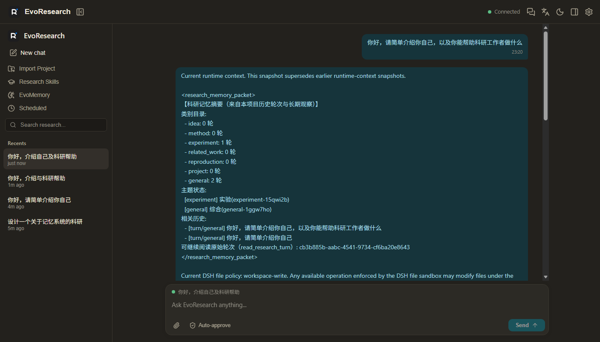
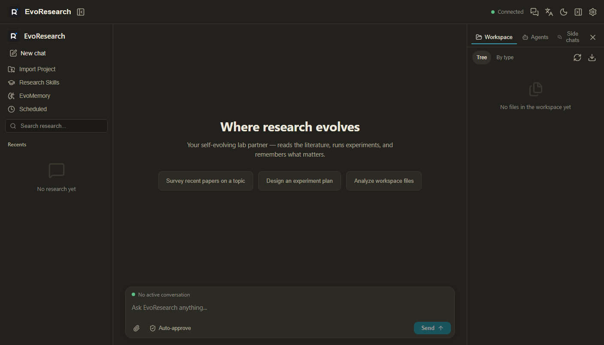
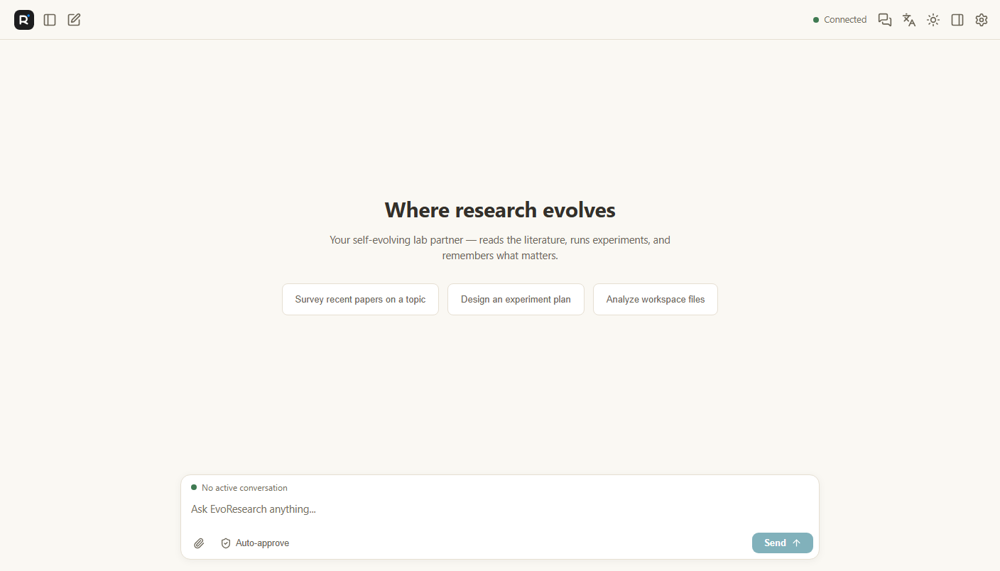
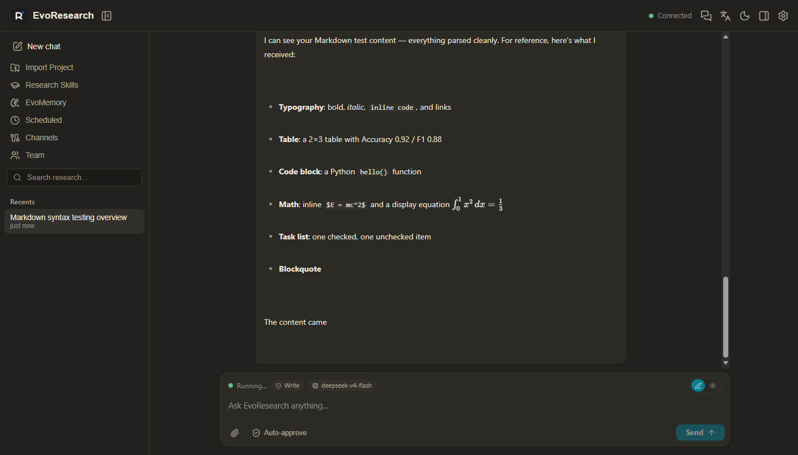
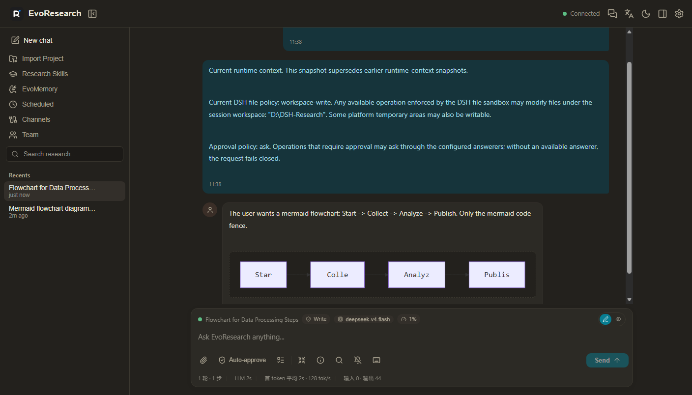

<div align="center">

# 🔬 EvoResearch

**面向科研的自主智能体 —— 基于 deepseek-harness（DSH）0.1.0-rc.6 构建**

用 TypeScript / Node.js 实现的科研智能体能力套件：**自进化科研记忆、项目工作区、
多智能体团队、定时任务、多通道接入、自定义工作台界面与 Windows 桌面版**。

[](https://github.com/Karbo123/DSH-EvoResearch/releases)
[](https://awesome-dsh-plugin.com)
[](https://www.typescriptlang.org/)
[](https://nodejs.org/)
[](https://github.com/deepseek-ai/deepseek-harness)
[](https://tauri.app/)
[]()
[](LICENSE)

**安装包仅 ~45 MB**（WebView2 复用系统组件）· 零 Python · 不依赖 deepagents



</div>

---

## 🖼️ 界面一览

EvoResearch 自带**完全自有的工作台界面**（自建浏览器表面，不加载官方 DSH 外壳）：
暖色"纸面"设计、青色品牌色，浅/深双主题，三栏可拖拽布局 —— 对话、会话历史、右侧
工作区检查器一屏尽览。

| 深色主题 · 三栏工作台 | 浅色主题 · 欢迎页 | 深色主题 · Markdown 渲染 | 深色主题 · Mermaid 流程图 |
|---|---|---|---|
|  |  |  |  |

> 输入面板的状态条与底部统计条（轮·步 / LLM 耗时 / tok/s / 上下文用量 / 权限模式）已在截图中体现。

## ✨ 特性一览

| | 特性 | 说明 |
|---|---|---|
| 🧠 | **科研记忆** | 每轮对话自动进入 Turn Catalog，七类多标签分类（idea/method/experiment/related_work/reproduction/project/general），FTS5 + RRF 混合检索，每轮注入 ≤6000 token 记忆包 |
| 🎯 | **Goal Contract 长程目标控制** | 长期任务自动生成目标合同，四轴保守判定（目标/范围/证据/完成），证据链可审计推进 |
| 📂 | **科研项目工作区** | `projects/<name>/.evoresearch-data/` 数据随项目目录隔离，项目即 git 仓库，支持导入与 AI 自动命名创建 |
| 🤖 | **多智能体团队** | 6 个科研角色预设（规划/调研/编码/调试/数据分析/写作），`/expert invite` 一键邀请 |
| 🛠️ | **AutoSkills 技能蒸馏** | 从记忆观测自动聚类生成可复用技能提案，审核通过后写入技能目录 |
| ⏰ | **定时任务** | 自研 cron 解析（Vixie 语义），结果直达结果线程，支持「Report to main chat」 |
| 🌐 | **多通道接入** | Telegram 可用；Slack / QQ / 微信 / 飞书 / Signal 适配器框架就绪 |
| 👁️ | **视觉检查工具** | `vision_check` 工具 + 截图脚本，让模型能"看见"界面并自检（OpenAI 兼容视觉模型） |
| 💬 | **斜杠命令** | `/project` `/memory` `/schedule` `/channel` `/expert` `/autoskills` |
| 🖥️ | **自定义工作台界面** | 自建浏览器表面（不加载官方 ui-\* 外壳）：顶栏 + 会话历史 + 真实多轮对话 + 输入面板 + 右侧检查器，浅/深双主题，中英双语 |
| ✍️ | **Markdown 渲染** | 消息与输入框 Write/Preview 双模式：GFM 表格、任务列表、KaTeX 数学公式（字体内联）、highlight.js 科研语言子集高亮、**Mermaid 流程图**（回答结束后惰性加载绘制，独立 chunk 不拖慢首屏）、DOMPurify 白名单净化 |
| 📜 | **历史分页与滚动** | 默认只渲染最近 100 条，Load earlier 向前翻页且滚动锚定不跳动；仅在位于底部时自动跟随新消息，上滚时右下角出现「回到最新」并释放旧页；忙时消息进入队列 |
| ⌨️ | **输入辅助** | 斜杠命令候选框（目录动态读取 dsh-commands 注册表 + 平台命令镜像，Tab/方向键/Esc 导航）、`@文件` 补全（workspace 递归树、基名优先排序、发送时小型文本自动注入内容）、每 workspace 输入历史（最近 200 条，空输入上下键浏览、前缀建议） |
| 🎛️ | **会话动作** | 输入面板动作条：Compact（二次确认 → `/compact` 摘要投影）、Current 弹窗（Thread/workspace/模型/权限/token·context/专家/事件数/会话文件路径与大小 + Clear view 仅清展示不删数据）、Search（先搜当前视图、Full history 走全历史搜索、点击跳转高亮）、Notify（浏览器通知开关）、Shortcuts（键盘规则表） |
| 🧵 | **会话管理与 Side Chat** | Recents 行悬停操作：重命名（官方 session.rename）、导出 JSON/Markdown（§41.8 格式）、从该会话派生 Side Chat（官方 session.fork，需已完成轮次，失败透出原因）；侧聊不混入普通 Recents；Inspector Side chats 页：Blank 空白侧聊（仅继承 workspace）/Inherit 继承侧聊 + tab 列表 + 打开；忙时队列弹层：编辑/删除/清空（官方 session.updateQueue） |
| 🤖 | **模型选择器** | 状态条模型名本身是按钮（§25.2）：点击弹出 provider 分组目录（llm 注册表动态读取 + 各 adapter listModels），选择即保存默认模型并即时生效 |
| 🛡️ | **HITL 工具审批** | 待审批工具调用显示为卡片（工具名/调用 ID/审批理由），Approve 放行（实测沙箱升级并写入文件）/ Reject 拒绝（实测不执行）；审批期间发送按钮禁用（§21.2） |
| ⚙️ | **Dynamic Workflow** | 输入区上方阶段条：工作流名称 + 子任务标签（running/done/failed 状态色）+ 完成数（n/m）+ 实时耗时 + 结束原因；右侧 X 二次确认清除（仅移除浏览器记录，§24） |
| ⏳ | **后台任务** | 输入面板后台任务按钮（运行中计数徽标）→ 弹层列出会话后台作业：类型/名称/详情/状态（running·stopping·completed·killed·failed 状态点）/实时耗时（官方 jobsBySession 快照，§21.6） |
| 📊 | **会话状态条与统计** | 输入面板实时徽章（排队消息 / 进行中目标 / 权限模式 Read-only·Write·Full effect / 当前模型 / 上下文用量%）+ 底部统计条（轮·步 \| LLM 耗时 · 工具耗时 \| 首 token 平均 · tok/s \| 缓存命中 \| 输入·输出 tokens） |
| 🧩 | **业务面板** | EvoMemory（项目/七类统计/目标）、Scheduled（任务列表/添加/删除）、Research Skills（AutoSkills 提案审核：Approve/Reject/Run）、Channels（消息通道启停）与 Team（科研角色邀请/清空）、Workspace（项目导入）面板，经工作台侧栏菜单直达 |
| 🗂️ | **工作区文件浏览器** | Inspector 内目录树（懒加载）+ 文本编辑（Ctrl+S 原子保存）+ 图片/PDF/HTML 内联预览 |
| 🤖 | **Agent 检查器** | Inspector 的 Agents 页实时列出当前会话的子代理树（深度缩进 / 运行态 / one-shot·continuable 模式徽标），消息气泡支持一键复制 |
| 🪟 | **Windows 桌面版** | Tauri 2 + Node sidecar，无边框自绘标题栏（原生拖拽 + 窗口控制），NSIS 安装包 **~45 MB**（实测），含全部后端 |

## 🚀 快速开始

### 环境要求

- **Windows 10/11**（当前仅支持 Windows）
- **Node.js ≥ 24**（需要内置 `node:sqlite` 与 zstd；推荐 24 LTS 或 26）
- **npm ≥ 10**

### 方式一：Windows 桌面版（开箱即用）

从 [GitHub Releases](https://github.com/Karbo123/DSH-EvoResearch/releases) 下载
`EvoResearch_0.1.0_x64-setup.exe`（**~45 MB**），双击安装：
窗口内是完整工作台界面，后端（Node sidecar）自动启动、随窗口退出自动清理，无需手动配置。

### 方式二：网页版（构建后运行）

```bash
# 1. 克隆仓库
git clone https://github.com/Karbo123/DSH-EvoResearch.git
cd DSH-EvoResearch

# 2. 构建（插件 + 自定义表面）
npm install
npm run build
npm run verify        # 可选：70 个单元测试 + bundle/docs 校验

# 3. 用示例 profile 启动（独立端口，避免与现有 DSH 冲突）
npx @deepseek-ai/dsh --profile profiles/evoresearch --port 3081
# 浏览器打开 http://127.0.0.1:3081
```

### 方式三：作为 DSH profile bundle 挂载

在任意 DSH 部署中把本仓库 `profiles/evoresearch/` 作为 profile：

```jsonc
// <你的 DSH profile 目录>/package.json
{
  "name": "dsh-profile-evoresearch",
  "private": true,
  "dependencies": {
    "@deepseek-ai/dsh-base": "^0.1.0-rc.6",
    "@evoresearch/dsh-app": "file:path/to/DSH-EvoResearch/packages/evoresearch-app",
    "@evoresearch/dsh-plugin": "file:path/to/DSH-EvoResearch/packages/evoresearch-plugin"
  },
  "dsh": {
    "profile": {
      "bundles": [
        "@deepseek-ai/dsh-base",
        "@evoresearch/dsh-app",
        "@evoresearch/dsh-plugin"
      ]
    }
  }
}
```

> `@evoresearch/dsh-app` 是自定义浏览器表面 bundle：复用 DSH host 引擎与官方传输/运行时，
> 但**不加载**官方 `ui-*` 外壳 —— 打开即是 EvoResearch 自己的工作台界面。

```bash
npm install            # 在 profile 目录安装依赖
npx @deepseek-ai/dsh --profile <profile名>
```

启动后打印：

```
[evoresearch] host 插件激活（dataRoot: ...）
evoresearch: http://127.0.0.1:3080
```

## 🧪 建议：使用独立 DSH 环境测试（避免与现有环境冲突）

如果你目前通过 `npx @deepseek-ai/dsh web` 使用 DSH，**强烈建议为 EvoResearch 建一个独立 profile**：
它与你正在用的环境完全隔离（独立端口、独立会话、独立数据目录），互不干扰。

```bash
# 1. 创建独立 profile 目录（DSH_HOME 默认为 ~/.dsh）
mkdir -p ~/.dsh/profiles/evoresearch
cd ~/.dsh/profiles/evoresearch

# 2. 写入 profile 声明（内容见上方「方式三」），然后
npm install

# 3. 用独立端口启动（默认 3080，用 --port 指定其他端口）
npx @deepseek-ai/dsh --profile evoresearch --port 3081
# 浏览器打开 http://127.0.0.1:3081
```

> 仓库内置了可直接使用的示例 profile：`profiles/evoresearch/`（已声明三个 bundle）。

## ⚙️ 配置

在 DSH 的 `settings.yaml` 中加入 `evoresearch` 段（或设置环境变量）：

```yaml
evoresearch:
  dataRoot: D:\evoresearch        # 部署根目录（projects/ 所在），默认 $EVORESEARCH_DATA_ROOT 或 cwd
  memoryTokenBudget: 6000         # 每轮科研记忆包 token 预算
  auxiliaryModel:                 # 分类/Goal 提取用辅助模型（缺省取当前默认模型）
    provider: deepseek-official
    model: deepseek-v4-flash
  autoStartChannels: false        # 启动时自动启动已配置通道（如 Telegram）
  memoryEnabled: true
  visionEnabled: true             # 是否注册 vision_check 视觉检查工具（模型未配置时自动跳过）
```

## 🧠 科研记忆怎么工作

```
用户消息 ──▶ session/event
              │
              ▼
  1. Turn Catalog 立即落库（pending）
  2. 后台：LLM 七类分类（失败自动确定性回退）
           → topic 归一化（复用已有主题）
           → topic state 更新
           → 长程检测 → Goal Contract（v3）
           → 记忆包构建（≤6000 token，RRF 混合召回）
              │
              ▼
  3. 每步模型调用前注入 <research_memory_packet>
  4. turn/end：completed/interrupted + Raw Turn Archive 归档
```

- 记忆数据存放在每个项目的 `.evoresearch-data/memories/`：
  `research_memory.db`（SQLite + FTS5）+ `observations/*.md`（人类可读、git 可管理）；
- 模型可通过 `search_research_history`、`read_research_turn`、`create_observation` 等工具按需读写；
- 既有会话历史会在首次使用时**后台自动回填**索引（断点续做，可重建）。

## 🖥️ 桌面版（Tauri 2 + Node sidecar）

| 项 | 值 |
|---|---|
| 安装包 | `EvoResearch_0.1.0_x64-setup.exe`，**~45 MB**（NSIS/LZMA） |
| 运行时 | 复用系统 WebView2（Win10/11 内置） |
| 后端 | Node 24 LTS sidecar（独立 DSH_HOME，不污染用户环境） |
| 体积优化 | provider SDK 裁剪（deepseek profile 思路）、node-pty/sharp 仅 win32-x64 |

构建：

```bash
node desktop/scripts/build.mjs
# 产物：desktop/src-tauri/target/release/bundle/nsis/EvoResearch_0.1.0_x64-setup.exe
```

## 🛠️ 开发

```bash
npm install          # 安装 workspace 依赖
npm run build        # 插件（tsc + client bundle）+ 自定义表面（node half + client + frontend dist）
npm run typecheck    # 严格类型检查
npm test             # 70 个单元测试（node:test）
npm run verify       # build + test + bundle 校验 + docs 校验
```

```
packages/evoresearch-plugin/   # @evoresearch/dsh-plugin —— 科研能力插件（host 服务）
  ├── src/host/                # Host 插件（workspace/memory/scheduler/channels/...）
  └── cordis.patch.yml         # bundle patch（evoresearch-host 服务行）
packages/evoresearch-app/      # @evoresearch/dsh-app —— 自定义浏览器表面 bundle
  ├── src/runtime.ts           # app-runtime（serve 前端 dist / 表面提示 / URL 打印）
  ├── src/client/              # 工作台 UI 插件（root slot + layout + 会话消息管线）
  │   ├── index.ts             #   顶栏 + 三栏布局 + 会话订阅/发送
  │   ├── conversation.ts      #   消息 Definition（官方语义裁剪）+ chat view
  │   ├── chat.ts              #   消息气泡渲染 + 输入面板
  │   ├── threadlist.ts        #   会话历史侧栏
  │   ├── inspector.ts         #   右侧工作区检查器
  │   └── styles.ts            #   设计系统（暖色纸面 + 青色品牌，浅/深主题）
  ├── frontend/                # 前端外壳入口（AppWebEntry 内核）
  └── vendor/                  # vendored 官方 client-modules 源码（构建时 alias）
profiles/evoresearch/          # 示例 DSH profile（三个 bundle）
desktop/                       # Tauri 2 桌面壳 + Node sidecar 打包脚本
docs/                          # 中文文档（架构/功能映射/开发/桌面）
```

## 📚 文档

| 文档 | 内容 |
|---|---|
| [docs/00-decisions.md](docs/00-decisions.md) | 技术选型决策（存储、嵌入模型、桌面方案等） |
| [docs/01-architecture.md](docs/01-architecture.md) | 架构设计与数据流 |
| [docs/02-feature-map.md](docs/02-feature-map.md) | 功能地图（能力清单、设计与状态） |
| [docs/03-development.md](docs/03-development.md) | 开发指南（挂载、配置、扩展点） |
| [docs/04-desktop.md](docs/04-desktop.md) | Windows 桌面版构建与体积优化 |

## ❓ FAQ

**Q：为什么基于 deepseek-harness 而不是自己写框架？**
DSH（0.1.0-rc.6）提供会话、模型路由、子代理、审批、技能、MCP 等完整平台能力，
EvoResearch 只做「科研化」扩展（记忆、项目、团队、调度、通道、界面），避免重复造轮子。

**Q：界面是 DSH 自带的吗？**
不是。`@evoresearch/dsh-app` 是**自定义浏览器表面**：host 引擎与传输完全复用官方
（会话、模型、工具、审批……），但浏览器端不加载官方 `ui-*` 外壳，界面是
EvoResearch 自己的工作台（暖色纸面设计、浅/深双主题，含真实多轮对话与会话历史）。

**Q：数据存在哪里？**
每个科研项目一个独立目录 `projects/<name>/`，内部 `.evoresearch-data/` 存放
记忆库、观测文件与调度任务；项目本身是 git 仓库，可整体迁移、导入、备份。

**Q：没有网络/API Key 时能用吗？**
分类与记忆包构建在 LLM 失败时自动退化（确定性分类 + 纯 FTS5 检索），不阻塞主回答。

**Q：如何接入更多消息通道？**
实现 `ChannelAdapter` 接口（`src/host/channels/base.ts`）并在 `adapters.ts` 注册即可；
Telegram 已提供完整实现（长轮询，仅需 `EVORESEARCH_TELEGRAM_TOKEN`）。

## 🤝 贡献

欢迎 PR 与 Issue：完善通道适配器、接入本地/远端 Embedding、增强业务面板（记忆/调度/团队）等。
代码风格：TypeScript 严格模式、中文注释、`node:test` 单测覆盖。

## 📄 License

MIT
